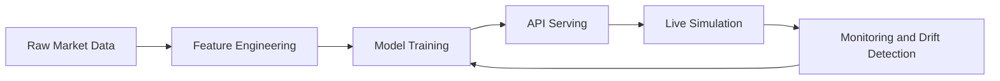

# Architecture Diagram

```mermaid
flowchart LR
  A[Raw Market Data] --> B[Feature Engineering]
  B --> C[Model Training]
  C --> D[API Serving]
  D --> E[Live Simulation]
  E --> F[Monitoring and Drift Detection]
  F --> C
```